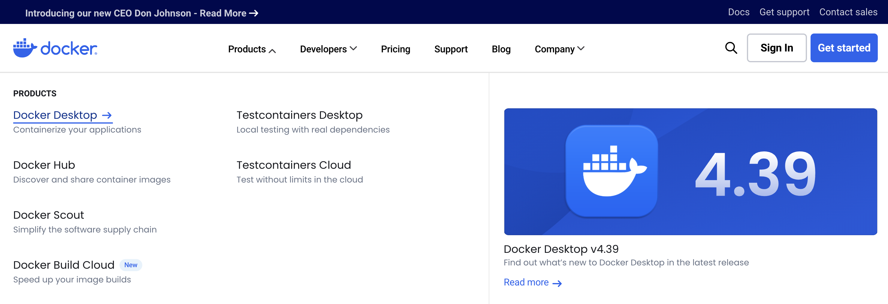
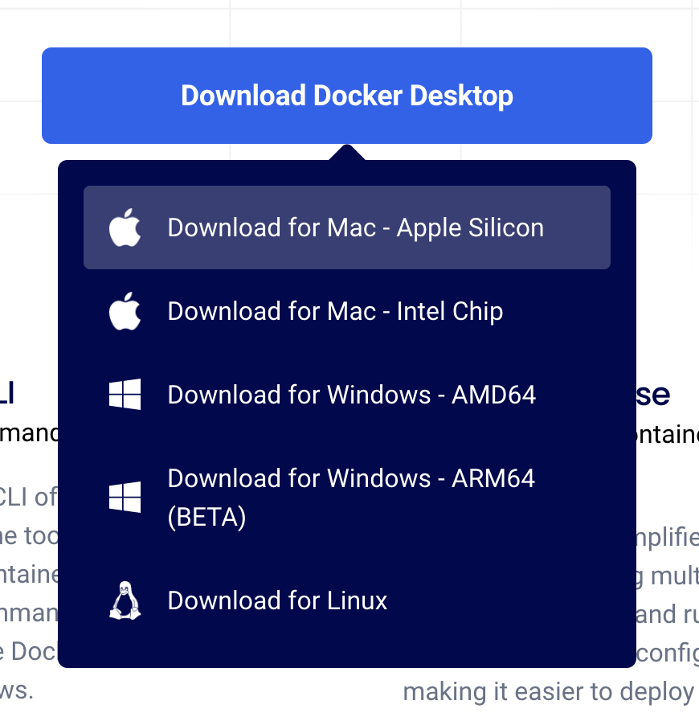
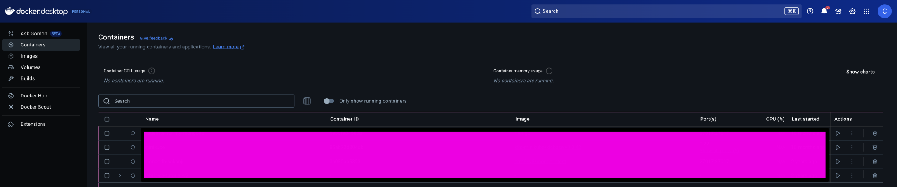
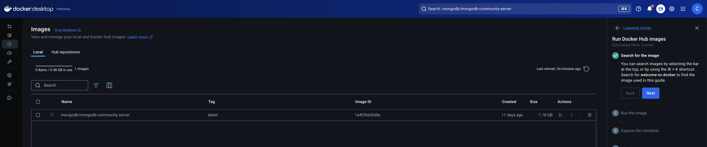
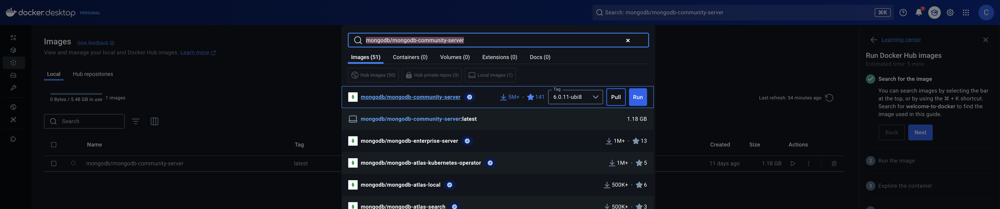
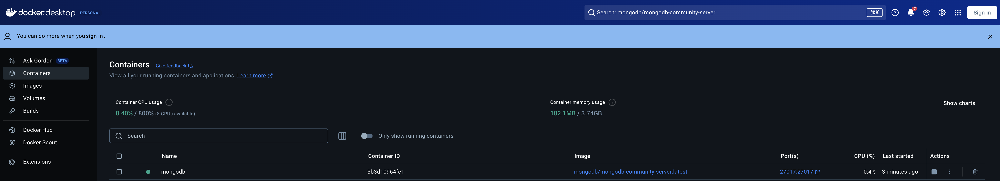
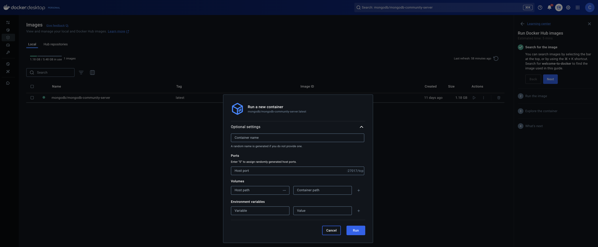
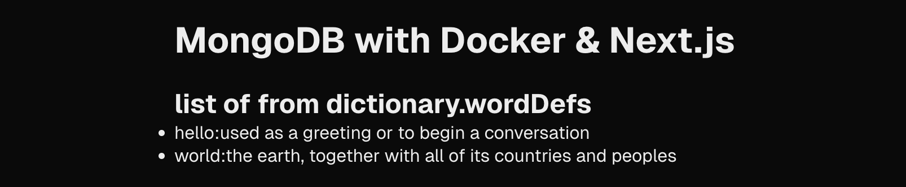

# MongoDB in Docker

In this guide, we will learn how to:

- create a Docker container with MongoDB installed
- connect to the MongoDB container from the shell
- connect to the MongoDB from different programming languages: Node.js, TypeScript, Go, Java & Python
- create a database and a collection
- insert and query data
- stop and remove the MongoDB container
- create a reusable Docker image with all the tools, configurations and data we need

# Step 1: Installing Docker Desktop

In order to manage Docker containers on your machine, you can either use the Docker CLI or the Docker Desktop application. For this guide, we will first use the Docker Desktop application which is more intuitive and user-friendly. After, we will use Docker compose to manage the image using a configuration file. But first things first, let's install Docker Desktop, create and use our first container.

Head to the [Docker page](https://www.docker.com/products/docker-desktop/), and inside `Products` click on `Docker Desktop`. You will be redirected to the download page.



Choose the version that fits your operating system and click on the download button:



After the download is complete, install Docker Desktop on your machine and run it. You should be welcomed by the Docker Desktop dashboard:



# Step 2: Getting a MongoDB Image

Now that we have Docker Desktop installed, we can start creating our MongoDB container. First, we need to get the MongoDB image from the Docker Hub. Open your terminal and run the following command:

```bash
docker pull mongodb/mongodb-community-server:latest
```

You should now see it appear in the images list:



Alternatively, you can search for the MongoDB image in the Docker Desktop dashboard and click `Pull` (the search bar is located at the top of the dashboard):



# Step 3: Running the MongoDB Image

Now that we have the MongoDB image, we can create a container from it. Run the following command in your terminal:

```bash
docker run --name mongodb -p 27017:27017 -d mongodb/mongodb-community-server:latest
```

You should see the container appear in the container list:



You can also type the following command to list all the running docker containers:

```bash
% docker container ls
CONTAINER ID   IMAGE                                     COMMAND                  CREATED         STATUS         PORTS                      NAMES
3b3d10964fe1   mongodb/mongodb-community-server:latest   "python3 /usr/local/…"   5 minutes ago   Up 5 minutes   0.0.0.0:27017->27017/tcp   mongodb
```

Alternatively, you can run an image from the Docker Desktop dashboard. Click on `Run` next to the MongoDB image and select the different options:



# Step 4: Connecting to the MongoDB Container

Now that we have the MongoDB container running, we can connect to it from the shell using `mongosh`. Run the following command in your terminal:

```bash
mongosh --port 27017
Current Mongosh Log ID: 67dfdc06686335afb13b1bb0
Connecting to:          mongodb://127.0.0.1:27017/?directConnection=true&serverSelectionTimeoutMS=2000&appName=mongosh+2.3.8
Using MongoDB:          7.0.17
Using Mongosh:          2.3.8
mongosh 2.4.2 is available for download: https://www.mongodb.com/try/download/shell

For mongosh info see: https://www.mongodb.com/docs/mongodb-shell/

------
   The server generated these startup warnings when booting
   2025-03-23T09:55:07.415+00:00: Using the XFS filesystem is strongly recommended with the WiredTiger storage engine. See http://dochub.mongodb.org/core/prodnotes-filesystem
   2025-03-23T09:55:08.031+00:00: Access control is not enabled for the database. Read and write access to data and configuration is unrestricted
   2025-03-23T09:55:08.031+00:00: /sys/kernel/mm/transparent_hugepage/enabled is 'always'. We suggest setting it to 'never' in this binary version
   2025-03-23T09:55:08.031+00:00: vm.max_map_count is too low
------

test>
```

You are now connected to the MongoDB container. You can run the following command to list all the databases:

```bash
test> show dbs
admin   40.00 KiB
config  12.00 KiB
local   40.00 KiB
```

Most of the information in this section can be found [in this guide on mongodb website](https://www.mongodb.com/docs/manual/tutorial/install-mongodb-community-with-docker/).

# Step 5: Creating a new Database, inserting and querying data

Before going any further and learn how to connect to the MongoDB container from different programming languages, let's create a new database, a new collection, insert some data and query it.

First, let's create a new database called `dictionary` which will contain a collection called `wordDefs` of words and their definitions in a given language. Run the following commands in the `mongosh` shell:

```bash
test> use dictionary
```

This first command switches to the `dictionary` database. At this point, the database is not yet created, but it will be created as soon as you insert data into it.

Now, let's insert some data into the `wordDefs` collection:

```bash
dictionary> db.wordDefs.insertOne({ word: "hello", definition: "used as a greeting or to begin a conversation" })
{
  acknowledged: true,
  insertedId: ObjectId('67dff28a26255525725c8c01')
}

dictionary> db.wordDefs.insertOne({ word: "world", definition: "the earth, together with all of its countries and peoples" })
{
  acknowledged: true,
  insertedId: ObjectId('67dff2a126255525725c8c02')
}
```

Now we can query all the data we just inserted:

```bash
dictionary> db.wordDefs.find().toArray()
[
  {
    _id: ObjectId('67dff28a26255525725c8c01'),
    word: 'hello',
    definition: 'used as a greeting or to begin a conversation'
  },
  {
    _id: ObjectId('67dff2a126255525725c8c02'),
    word: 'world',
    definition: 'the earth, together with all of its countries and peoples'
  }
]
```

We can also query a specific word:

```bash
dictionary> db.wordDefs.findOne({ word: "hello" })
{
  _id: ObjectId('67dff28a26255525725c8c01'),
  word: 'hello',
  definition: 'used as a greeting or to begin a conversation'
}
```

# Step 6: Connecting to MongoDB from Next.js

In this section, we will learn how to connect to the MongoDB container from a Next.js application and how to perform basic operations such as inserting and querying data from a collection.

## Step 6.1: Creating a new Next.js Project

First, we need to initialize a new Next.js application. Run the following command in your terminal:

```bash
% npx create-next-app docker-mongodb-nextjs

✔ Would you like to use TypeScript? … No / <Yes>
✔ Would you like to use ESLint? … No / <Yes>
✔ Would you like to use Tailwind CSS? … <No> / Yes
✔ Would you like your code inside a `src/` directory? … <No> / Yes
✔ Would you like to use App Router? (recommended) … No / <Yes>
✔ Would you like to use Turbopack for `next dev`? … <No> / Yes
✔ Would you like to customize the import alias (`@/*` by default)? … <No> / Yes
Creating a new Next.js app in /docker/mongodb/docker-mongodb-nextjs.

Using npm.

Initializing project with template: app


Installing dependencies:
- react
- react-dom
- next

Installing devDependencies:
- typescript
- @types/node
- @types/react
- @types/react-dom
- eslint
- eslint-config-next
- @eslint/eslintrc

added 303 packages, and audited 304 packages in 16s

127 packages are looking for funding
  run `npm fund` for details

found 0 vulnerabilities
Success! Created docker-mongodb-nextjs at /docker/mongodb/docker-mongodb-nextjs
```

Now, navigate to the newly created directory and run the following command to start the Next.js application to make sure everything is working:

```bash
% cd docker-mongodb-nextjs
% npm run dev

> docker-mongodb-nextjs@0.1.0 dev
> next dev

   ▲ Next.js 15.2.3
   - Local:        http://localhost:3000
   - Network:      http://192.168.0.29:3000

 ✓ Starting...
 ✓ Ready in 1242ms
```

You should be able to access it at [http://localhost:3000](http://localhost:3000).

## Step 6.2: Installing MongoDB dependency

Now that our MongoDB container and our Next.js app are running, we want to connect to the database. First, we need to install the `mongodb` package. This will allow us to instantiate a new MongoDB client, connect to the database, and perform CRUD operations.

```bash
% npm install mongodb

added 11 packages, and audited 315 packages in 2s

127 packages are looking for funding
  run `npm fund` for details

found 0 vulnerabilities
```

## Step 6.3: Instantiating a new MongoDB client

To interact with the MongoDB container, we need to instantiate a new MongoDB client. Create a new file `mongodb-client.ts` in the new folder `lib` and add the following code:

```typescript
import { MongoClient } from "mongodb";

const uri = process.env.MONGODB_URI as string;
const options = {};

let client: MongoClient;
let clientPromise: Promise<MongoClient>;

declare global {
  var _mongoClientPromise: Promise<MongoClient>;
}

if (!global._mongoClientPromise) {
  client = new MongoClient(uri, options);
  global._mongoClientPromise = client.connect();
}

clientPromise = global._mongoClientPromise;
export default clientPromise;
```

As you can see, this code:

- loads the mongoDB credentials from the environment variables
- creates a new MongoDB client if it doesn't exist
- saves it in the global scope
- connects to the MongoDB container
- returns a promise that resolves to the MongoDB client

For it to work, you need to set the `MONGODB_URI` environment variable. You can do this by creating a new file called `.env.local` in the root of the project and adding the following line:

```
MONGODB_URI=mongodb://localhost:27017
```

## Step 6.4: Creating a new API route to query all the documents from a collection

In order to interact with the MongoDB container, we need to create a new API route. Create a new api file `route.ts` under `app/api/getAll` that will allow us to query all the documents from our `wordDefs` collection inside the `dictionary` database:

```typescript
import { NextResponse } from "next/server";
import clientPromise from "@/lib/mongodb-client";

export async function GET() {
  try {
    const client = await clientPromise;
    const db = client.db("dictionary");
    const data = await db.collection("wordDefs").find({}).toArray();
    return NextResponse.json(data);
  } catch (error) {
    console.error("Error fetching data:", error); // Log the error for debugging
    return NextResponse.json({ error: "Error fetching data" }, { status: 500 });
  }
}
```

## Step 6.5: Using the API route in a component

To use the API route we just created, we will be creating a new component that will simply call the API `getAll` and display the data in a list.

Create a folder `app/components` and add a `DataList.tsx` file with the following code:

```tsx
"use client";
import { useEffect, useState } from "react";

type Data = {
  _id: string;
  word: string;
  definition: string;
};

export default function DataList() {
  const [data, setData] = useState<Data[]>([]);

  useEffect(() => {
    fetch("/api/getAll")
      .then((res) => res.json())
      .then((data) => setData(data));
  }, []);

  return (
    <div>
      <h1>MongoDB Data</h1>
      <ul>
        {data.map((item) => (
          <li key={item._id}>
            {item.word}:{item.definition}
          </li>
        ))}
      </ul>
    </div>
  );
}
```

## Step 6.6: Using our component in the home page

To test our component, we will be using it in the home page. Open the `pages/index.tsx` file and add the following code:

```tsx
import Image from "next/image";
import styles from "./page.module.css";
import DataList from "./components/DataList";

export default function Home() {
  return (
    <div className={styles.page}>
      <main>
        <h1>List of words from dictionary.wordDefs</h1>
        <DataList />
      </main>
    </div>
  );
}
```

You should see the following result:


